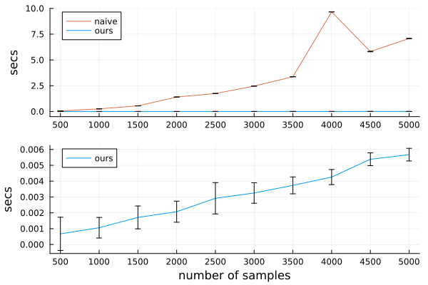

# Energy Distance Kernel ablation study

Here we perform a runtime comparison of the Energy Distance Kernel (EDK), vs a naive implementation (using pairwise comparisons) of the Gaussian-type kernel.

While the number of observations remains constant
(at $n=300$), we systematically vary the sample size used to represent the predicted distributions.

Each configuration was executed for a minimum of $25$ trials; the resulting data are illustrated in the following graph.

Since kernel matrix construction relies mostly on calculating pairwise distances, our timing benchmarks focus solely on the distance matrix computation.

All experiments were conducted on an NVIDIA A100 GPU.