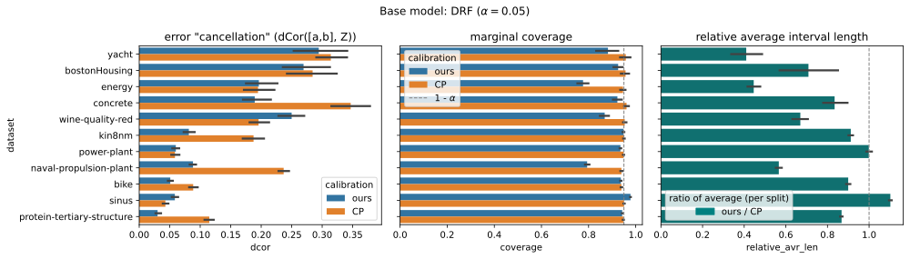
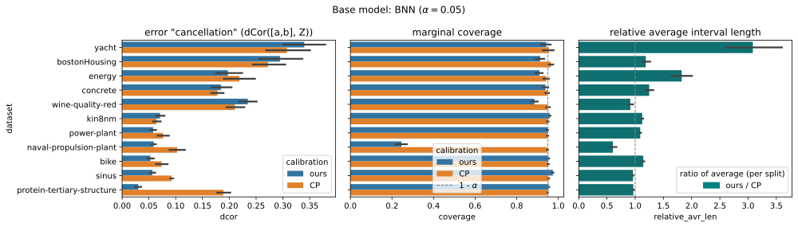
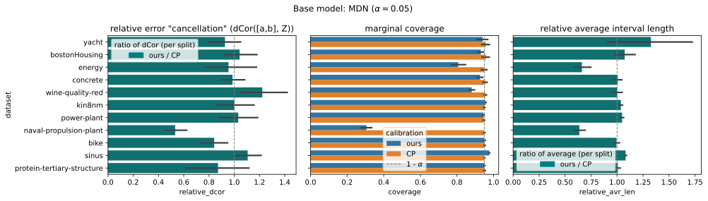
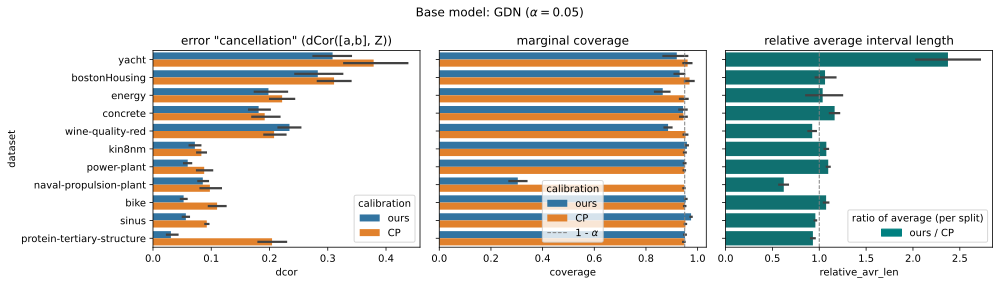

# Conformal Prediction comparison

Compare conformal prediction (CP) with the proposed recalibration framework.

We use the split conformal prediction framework with 
$\psi(x) = |x - \frac{1}{2}|$ of 
[Chernozhukov et al.: Distributional conformal prediction, 2021](https://arxiv.org/abs/1909.07889).

### Evaluation
We compare the CP intervals $[a,b] \subset \mathbb{R}$ at a fixed coverage level ($\alpha = 0.05$) against the interval
$$
[\tilde a, \tilde b] := [q_{\alpha /2}, q_{1 - \alpha /2}] \subset \mathbb{R}
$$ 
derived from the predictive quantiles $q$ of the recalibrated model.

We plot the marginal coverage level on the test set,
and the relative average width of the predicted intervals:
$$
\frac{\tilde b - \tilde a}{b-a}
$$

In order to highlight that standard CP procedures, such as Chernozhukov et al.'s (2021) only target marginal alignment of model errors, and therefore the "_error cancellation_" (i.e., over and underconfident predictions cancelling out on average) effect can occur, we plot the distance correlation $\mathrm{dCor}$
([Székely et al., 2008](https://arxiv.org/abs/0803.4101)) of the predicted interval (as a point in $\mathbb{R}^2$) and the pit transform of the prediction $Z = F(Y)$.

It is easy to see that $Z$ should ideally be independent of the prediction and therefore from the interval $[a,b]$. This independence condition means that the errors are evenly distributed w.r.t. the predictions and there are no systematically under / over confident predictions.

Since distance correlation is a normalized dependence measure, characterizing independence (i.e., $\mathrm{dCor} = 0 \iff$ the inputs are independent, and $0 \leq \mathrm{dCor} \leq 1$) it is a suitable metric to assess the amount of dependence between predictive intevals and the PIT transform.

## results

