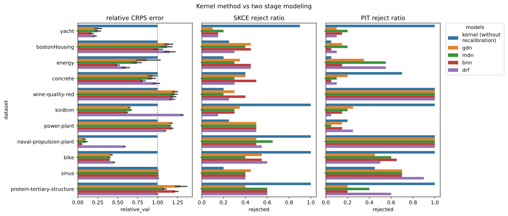

# Compare to kernelized predictions
We perform a direct comparison of our proposed recalibration algorithm, and the baseline model of only using kernelized predictions (without recalibration), trained on the union of training and calibration data.

This motivates the two stage learning approach, as we can see that
even kernel methods can have significant calibration errors. (See middle figure.)

Additionally, because kernel methods sometimes struggle to capture the mapping $X \mapsto \mathbb{P}_{Y|X}$, it is reasonable to use more sophisticated machine learning algorithms followed by a separate recalibration phase. (See eg datasets `bike` and `naval-propulsion-plant`.)

### Evaluation
We report the relative CRPS error of the models, normalized as a ratio to what the kernelized prediction achieves.

Additionally, we report the ratio of splits where the SKCE test rejected the hypothesis of auto calibration. The PIT calibration hypothesis test's results can also be found in a similar presentation.

### Results

### Implementation details
We used a gaussian kernel on the input space, and optimized the input kernel bandwith and regularization parameter via $5$-fold cross validation on the union of training and calibration data.

The initial guess for the input kernel bandwith was the median heuristic, and then we searched a logarithmically spaced grid around it.

The output kernel was the Laplacian kernel where the bandwith was set using the median heuristic.

See the [implementation](../models/kernel/script.jl) for details.
