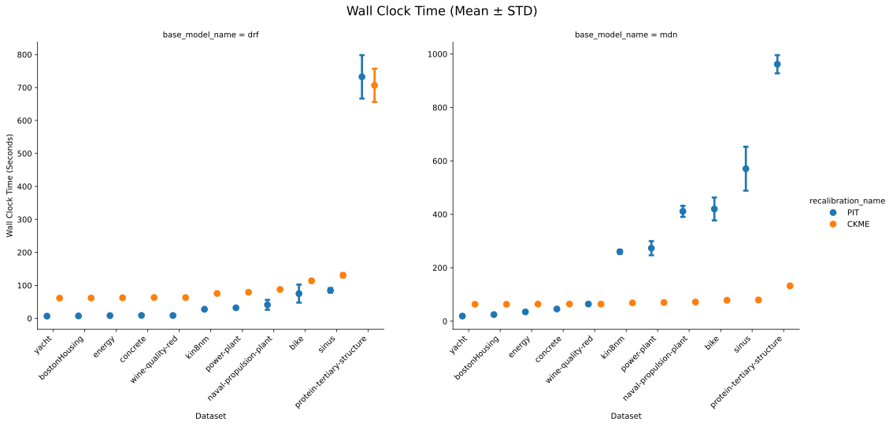

# Wall-clock time comparison 

Wall-clock time comparison: CKME recalibration (ours) vs. PIT recalibration (Kuleshov et al., 2018).

The relative latency of the PIT method stems from our implementation requirement to explicitly represent recalibrated predictive distributions for testing. For base models producing a continuous PDF (e.g., MDN), we utilized inverse CDF sampling with $n=1000$. In cases where the base model’s output was concentrated on discrete observations (e.g., DRF), we achieved PIT calibration via explicit weight transformation. 

All linear algebra operations for CKME recalibration were accelerated on an NVIDIA A100 GPU.